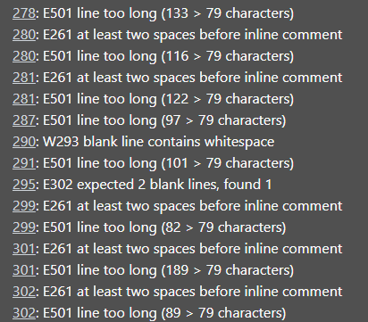

# Run Tracker

Run tracker allows users to learn to run 5-20 kilometers. The application recommends the user a training plan and allows then track and view their progress.

The deployed project can be found here: [Run Tracker](https://running-programme-694cea56c7e6.herokuapp.com/)

## User Experience (UX)

### Project Goals

- Help users to improve their fitness level by providing users an easy way to start running or to increase the distance they can run.
- Allow users to track their their progress for the duration of the programme.
- Validate the data the user inputs to ensure that the programme works correct and provides good user experience.

### User Stories

- As someone new to running, I want an easy to follow plan that gives me the weekly structure that I need in order to be able to start running.
- As a beginner or intermediate runner, I want a programme that helps me to push my limits and get better results.
- As a user of the application, I want to be able to store my running data.
- As a user of the application, I want to be able to view my progress and compare that to my plan.

### Flowchart

A flowchart to plan the logic of the programme was created using [Lucid](https://lucid.app/).

### Data Model

The data that user inputs is initially stored as variables. Once all the necessary data has been inputted by the user and it has been validated, the data is added to a Google Sheets.

Three worksheets are being used:

- one to store the four different running plans that the programme offers
- one to store which plan each user had chosen
- one to store the user's running data

[Back to top](#run-tracker)

## Features

### Main page

The user is given information about the application and is asked to select an option.

### Select plan

Collects information from the user in order to be able to select the most suitable plan for them based on the maximum distance that the user can currently run and their goal. Adds the username and the user's select plan to Google Sheets.

### View plan

Displays the selected 8-week plan to the user and advises user when to return to input their results.

### Input data

Asks the user to input their username and if the username is recognised, allows the user to input previous week's running data.

### Next week's plan

After the user has added their latest running data, next week's plan is displayed to user, and their encouraged to keep following the running programme and to return the following week to add that week's results.

### Programme finished

Inform the user that they have finished the programme and advises them to how they can view their results.

### View progress

Asks the user to input their username and if the username is recognised, allows the user to view their results and their plan.

[Back to top](#run-tracker)

## Technologies Used

### Language Used

- [Python3](https://www.python.org/)

### Frameworks, Libraries and Programs Used

- [Lucid](https://lucid.app/) was used to create the programme flowchart.

- [VSCode](https://code.visualstudio.com/) was used for writing code, committing, and then pushing to GitHub.

- [GitHub](https://github.com/) was used to store the project after pushing.

- [Heroku](https://id.heroku.com/) was used to deploy the application.

- [CI Python Linter](https://pep8ci.herokuapp.com/#) was used to validate the Python code.

- [Tabulate](https://pypi.org/project/tabulate/) library was used to present the data in a table format.

- [Colorama](https://pypi.org/project/colorama/) library was used to apply color to the terminal text.

[Back to top](#run-tracker)

## Testing

### Code Validation

[CI Python Linter](https://pep8ci.herokuapp.com/#) was used to validate the Python code for PEP8 requirements.

The code was validated for the first time, the following warning and error messages were received.

The warnings and errors were addressed and it was confirmed that no errors remained.

### Manual Testing

<table>
    <tr>
        <th>Feature</th>
        <th>Outcome</th>
        <th>Example</th>
        <th>Pass/Fail</th>
    </tr>
    <tr>
        <td rowspan=3>Select option</td>
        <td>Validate if value is empty</td>
        <td></td>
        <td>Pass</td>
    </tr>
    <tr>
        <td>Validate if value is number other than 1, 2 or 3</td>
        <td></td>
        <td>Pass</td>
    </tr>
    <tr>
        <td>Validate if value is not an integer</td>
        <td></td>
        <td>Pass</td>
    </tr>
    <tr>
        <td rowspan=4>Select username</td>
        <td>Validate if value is empty</td>
        <td></td>
        <td>Pass</td>
    </tr>
    <tr>
        <td>Validate if value is shorter than 3 characters</td>
        <td></td>
        <td>Pass</td>
    </tr>
    <tr>
        <td>Validate if value is longer than 15 characters</td>
        <td></td>
        <td>Pass</td>
    </tr>
        <tr>
        <td>Validate if value is already in use</td>
        <td></td>
        <td>Pass</td>
    </tr>
    <tr>
        <td rowspan=3>Enter maximum distance</td>
        <td>Validate if value is empty</td>
        <td></td>
        <td>Pass</td>
    </tr>
    <tr>
        <td>Validate if value is not an interger</td>
        <td></td>
        <td>Pass</td>
    </tr>
        <tr>
        <td>Validate if value is over 15</td>
        <td></td>
        <td>Pass</td>
    </tr>
    <tr>
        <td>Select option</td>
        <td>Select option</td>
        <td>Select option</td>
        <td>Select option</td>
    </tr>
</table>

## Deployment

The application was deployed using [Heroku](https://id.heroku.com/) and Code Institute's mock terminal.

The following steps were taken to deploy this application:

1. Create requirements.txt file and run `pip3 freeze > requirements.txt` command in the terminal to create a list of requirements. Commit and push these changes to Github.
2. Go to the Heroku dashboard and click on "Create new app".
3. Once the app has been created, go to "Config Vars" under the "Settings" tab.
4. Click on "Reveals Config Vars" and in the field for KEY enter CREDS and in the field for VALUE copy-paste the entire creds.json file.
5. Add another Config Var, KEY: PORT and VALUE: 8000.
6. Go to "Buildpacks" section and set the buildpacks to `Python` and `NodeJS` in that order.
7. Go to the "Deploy" tab, select "GitHub" and click on "Connect to GitHub" and
8. Search for the repository name and click "Connect" next the repository name.
9. Choose "Automatic deploys" or "Manual deploys" to deploy your application.

[Back to top](#run-tracker)

## Credits

### Content

All content was created by the developer.

### Media

- The ASCII art was created using [ASCII.co.uk](https://ascii.co.uk/text).

### Code

- [Geeksforgeeks](https://www.geeksforgeeks.org/how-to-make-a-table-in-python/) was consulted to learn how how to create a table in Python

- [Stackoverflow](https://stackoverflow.com/questions/287871/how-do-i-print-colored-text-to-the-terminal#287944) was consulted to learn how to add color to the text

- Code Institute's Love Sandwiches walkthrough project inspired this project and the steps of how to connect Python to Google Sheets were taken from it.
